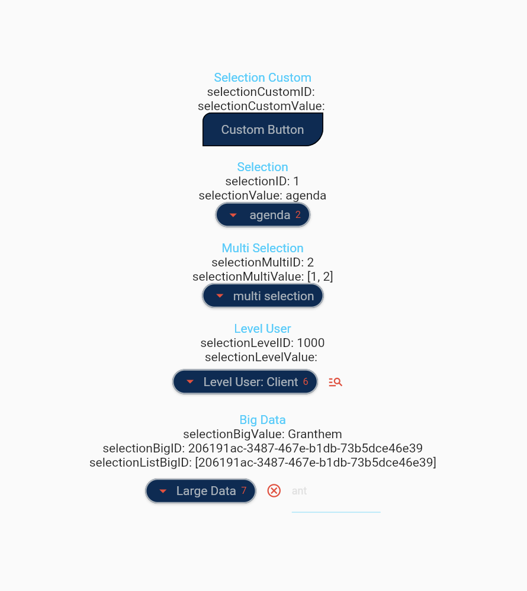
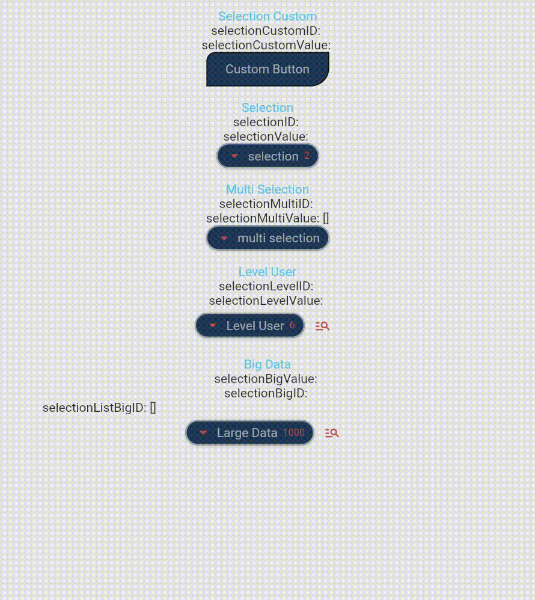

## Drop_Down_Data

[](https://pub.dev/packages/drop_down_data)
[](https://github.com/MrPiou94/drop_down_data/stargazers)

## Description

Drop-down list of data allowing to make one or more selections and to search among the data or an identifier.

## 📖 Installation 

To use this plugin, add `drop_down_data` as a [dependency in your pubspec.yaml file](https://flutter.io/platform-plugins/).
Following steps will help you add this library as a dependency in your flutter project.

- Run `flutter pub add drop_down_data`, or add video_editor to `pubspec.yaml` file manually.

```yaml
dependencies:
  drop_down_data: ^0.0.4
```

- Import the package in your code:

```dart
import 'package:drop_down_data/drop_down_data.dart';
```


## 📸 Screenshots

| Example                    | Video                             |
|----------------------------| --------------------------------- |
|  |       |


## 👀 Usage

```dart
List<DataDropDown> listData = [];

@override
void initState() {
  super.initState();
  List<Map<String, dynamic>> listMap = [];
  listMap.add({"id": "1", "name": "agenda"});
  listMap.add({"id": "2", "name": "contact"});
  listData = List<DataDropDown>.from(listMap.map((model) => DataDropDown.fromJson(model)));
}

@override
void dispose() {
  _controller.dispose();
  super.dispose();
}

@override
Widget build(BuildContext context) {
  ThemeData theme = Theme.of(context);
  TextTheme textTheme = theme.textTheme;
  ColorScheme colorScheme = theme.colorScheme;
  return Scaffold(
    appBar: AppBar(
      title: Text(widget.title),
    ),
    body: Center(
      child: Column(
        mainAxisAlignment: MainAxisAlignment.center,
        children: <Widget>[

          Text("Selection", style: textTheme.bodyLarge!.copyWith(color: colorScheme.onSurface),),
          Text("selectionID: $selectionID"),
          Text("selectionValue: $selectionValue"),
          DropDownData(
              tooltip: "show menu",
              title: selectionValue != "" ? " " : "selection",
              value: selectionValue,
              uuidValue: selectionID,
              addFirstEmpty: true,
              viewNumber: true,
              research: false,
              researchCallback: (String val) { setState(() {}); },
              listData: listData,
              selectionCallback: (DataDropDown selection){
                if (kDebugMode) {
                  print(selection);
                  print(selection.id);
                  print(selection.name);
                }
                selectionValue = selection.name ?? "";
                selectionID = selection.id ?? "";
                setState(() { });
              }),
          
        ],
      ),
    ),
  );
}
```

## ✨ Credit

Created by Aylicrea [seel-channel](https://aylicrea.com/).