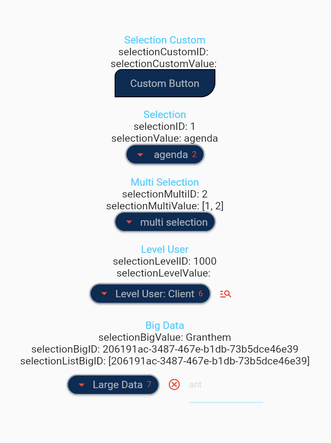

## Description

Drop-down list of data allowing to make one or more selections and to search among the data or an identifier.

## Getting Started

To use this plugin, add `drop_down_data` as a [dependency in your pubspec.yaml file](https://flutter.io/platform-plugins/).

## 📸 Screenshots

| Example                                 | Video                             |
| --------------------------------------- | --------------------------------- |
|                   |       |